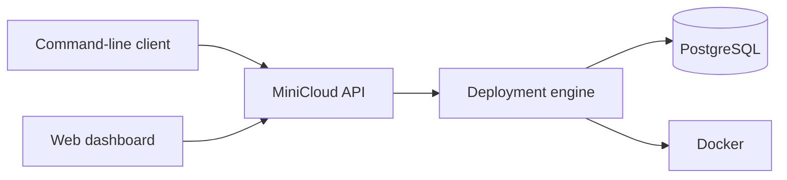
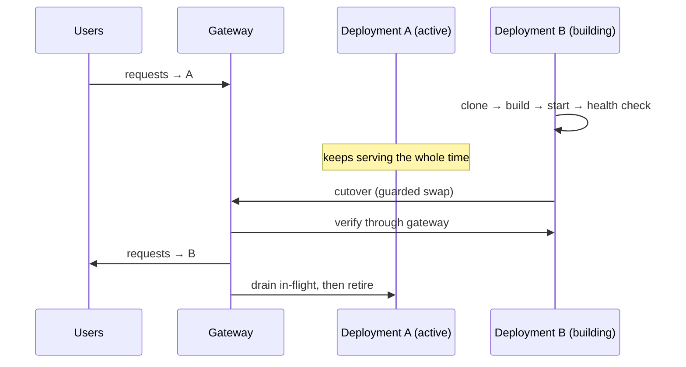

# MiniCloud

<div align="center">

**Deploy any git repo to Docker with one command.**
A lightweight, self-hosted Platform-as-a-Service for your own machine —
the Render/Heroku/Railway/Fly.io developer experience, running locally.

[](https://github.com/albertaizic/minicloud/actions/workflows/ci.yml)
[](../../releases)
[](https://nodejs.org)
[](https://www.typescriptlang.org)
[](LICENSE)

</div>

---

MiniCloud turns a repository into a running, health-checked container with a **stable URL per application**:

```bash
minicloud deploy https://github.com/example/my-api
# ✔ deployment is RUNNING at http://localhost:31542
#
# and permanently available at the stable app URL:
#   http://my-api.localhost:8080   <- survives every redeploy, rollback and restart
```

It clones your repo, builds the Dockerfile, starts an isolated container on a
free port, health-checks it, streams its logs live, detects crashes, and tracks
every deployment in PostgreSQL — with a CLI and a web dashboard on top.

| Overview | Deployment detail |
|---|---|
|  |  |

**Why this project exists.** MiniCloud is a deliberate, end-to-end exercise in
platform engineering: a real deployment pipeline with a strict state machine,
startup reconciliation between a database and Docker, crash detection, live log
streaming, and a tested public API — the same problems cloud PaaS products
solve, at an understandable scale.

## Features

- **Git-to-container pipeline**: clone → docker build → start → health check → RUNNING
- **Explicit deployment state machine** (QUEUED → CLONING → BUILDING → STARTING → HEALTH_CHECKING → RUNNING / FAILED / STOPPED)
- **Automatic host port allocation** in a configurable range
- **HTTP health checks** with bounded retries and configurable path/port/timeout
- **Live logs** over Server-Sent Events (build output + container stdout/stderr)
- **Crash detection**: a monitor marks crashed deployments FAILED with the exit code
- **Stop / restart / delete / redeploy**, all idempotent and concurrency-guarded
- **Startup reconciliation**: DB and Docker are re-synced on every API boot; orphaned containers are cleaned up
- **Environment variables & secrets** per application: plain vars are readable,
  secrets are AES-256-GCM-encrypted at rest and write-only (never returned by
  API, CLI or dashboard)
- **CPU & memory limits** enforced with Docker cgroups (`--cpus`, hard memory cap)
- **Deployment event timeline**: every lifecycle transition is persisted as an ordered event (clone/build/health/restart/crash/rollback) and queryable via API, CLI and dashboard
- **Rollback**: roll an application back to any previous successful deployment — creates a NEW deployment (history stays immutable), reuses the old image when available, rebuilds from the recorded commit otherwise
- **Automatic restart policy**: `disabled` or `on-failure` with a bounded attempt budget (0–10) and capped exponential backoff; manual stop/restart resets the budget and suppresses recovery
- **Runtime metrics**: live CPU %, memory used/limit, uptime and restart counts per deployment via Docker stats
- **Multi-service applications (v0.5)**: declare `web`/`api`/`worker` services in `minicloud.yml` — private networking per app, persistent volumes, dependency ordering, per-service limits/restarts/logs/metrics
- **Stable URLs + zero-downtime deploys (v0.4)**: every application gets `http://<app>.localhost:<gateway-port>`; replacements build and health-check in parallel, then traffic switches atomically — the old version keeps serving until the new one is verified
- **Persistent deployment queue (v0.7)**: durable, restart-safe job store with deterministic priority ordering (manual → rollback → git push → preview), configurable concurrency (`MINICLOUD_MAX_CONCURRENT_BUILDS`), per-application serialization, and automatic superseding of obsolete queued auto-deploys
- **Deployment cancellation (v0.7)**: cancel queued or in-flight work from API, CLI (`minicloud cancel`) or dashboard — candidate resources are cleaned up, the active revision never disturbed
- **Build cache (v0.7)**: exact-image reuse keyed on commit + Dockerfile + context content; unchanged rebuilds skip clone/build entirely, per-service reuse for multi-service apps
- **GitHub PR preview environments (v0.7)**: every pull request gets an isolated preview at `http://pr-<n>-<app>.localhost` with its own network and ephemeral storage — zero-downtime updates on new commits, full cleanup on close, production secrets and volumes excluded by default
- **REST API + CLI + web dashboard**
- **PostgreSQL persistence** with migrations

## Architecture



MiniCloud keeps the interface deliberately small: use the CLI or dashboard to
request a deployment, then the API records it and hands the work to the
deployment engine. The engine builds and runs containers through Docker while
PostgreSQL preserves application, deployment, and recovery state. This split
means the dashboard and command-line client can show the same durable status,
even after the API restarts.

For a deeper look at deployment states, routing, and recovery after a restart,
read [the architecture guide](docs/architecture.md).

## Prerequisites

- Node.js ≥ 20
- Docker Desktop (or any Docker daemon)
- Docker Compose v2
- Git

## Setup

```bash
git clone <this-repo> minicloud
cd minicloud
npm install
cp .env.example .env        # adjust if needed (see POSTGRES_HOST_PORT note below)
docker compose up -d postgres
npm run migrate
```

> **Note:** if a local PostgreSQL already listens on port 5432 (common on
> Windows), set `POSTGRES_HOST_PORT=5433` in `.env` (the default) so the
> MiniCloud database does not collide with it.

## Quick start

Terminal 1 — API:

```bash
npm run dev            # http://localhost:4000
```

Terminal 2 — dashboard:

```bash
npm run dev:dashboard  # http://localhost:5173
```

Deploy your first app:

```bash
minicloud deploy https://github.com/example/hello-node --name hello-node
minicloud apps
minicloud logs <deployment-id>
```

Or deploy one of the bundled examples. From the repo root:

```bash
cd examples/hello-node
npx serve .            # or push to any git remote and use that URL
```

## CLI

The CLI talks to the MiniCloud API (`MINICLOUD_API_URL`, default
`http://localhost:4000`):

```bash
minicloud deploy <git-url> [--name my-app] [--ref main]
minicloud apps
minicloud deployments [app-name]
minicloud status <deployment-id>
minicloud logs <deployment-id>       # live stream
minicloud stop <deployment-id>
minicloud restart <deployment-id>
minicloud delete <deployment-id>
minicloud wait <deployment-id>
```

minicloud deploy <git-url> [--name my-app] [--ref main]
minicloud apps
minicloud deployments [app-name]
minicloud status <deployment-id>
minicloud logs <deployment-id>       # live stream
minicloud stop <deployment-id>
minicloud restart <deployment-id>
minicloud delete <deployment-id>
minicloud wait <deployment-id>

# configuration (v0.2)
minicloud env <app>                          # list vars + secret keys
minicloud env set <app> KEY=VALUE
minicloud env delete <app> KEY
minicloud secret set <app> KEY               # value read hidden from stdin/TTY
echo "$VALUE" | minicloud secret set <app> KEY   # piped input also works
minicloud secret delete <app> KEY
minicloud limits show <app>
minicloud limits set <app> --memory 512 --cpu 1.5
minicloud limits clear <app>
```

## API overview

| Method | Path                     | Description                          |
|--------|--------------------------|--------------------------------------|
minicloud limits clear <app>

# reliability & observability (v0.3)
minicloud events <deployment-id>            # lifecycle event timeline
minicloud stats <deployment-id> [--watch]   # live CPU/memory/uptime
minicloud rollback <app> <deployment-id>    # roll back to a previous revision
minicloud restart-policy <app> [disabled|on-failure] [--max N]
minicloud prune [--yes]                     # remove stopped containers, unreferenced
                                            # MiniCloud images, stale workspaces
minicloud routes                            # gateway routing table + counters
minicloud services <app>                    # per-service status table
minicloud volumes <app>                     # persistent volumes of an app
minicloud logs <deployment> --service api   # per-service logs
minicloud stats <deployment> --service api  # per-service metrics

# stop/delete of the ACTIVE deployment requires --force (explicit outage)
```

## API overview

| Method | Path                     | Description                          |
|--------|--------------------------|--------------------------------------|
| GET    | `/api/health`            | API + Docker health                  |
| POST   | `/api/apps`              | Create application                   |
| GET    | `/api/apps`              | List applications (+ latest deploy)  |
| GET    | `/api/apps/:id`          | Application detail + deployments     |
| DELETE | `/api/apps/:id`          | Delete app and its deployments       |
| GET    | `/api/apps/:id/env`      | List env vars (values) + secret keys |
| PUT    | `/api/apps/:id/env/:key`       | Set env var (`{"value": "..."}`) |
| DELETE | `/api/apps/:id/env/:key`       | Delete env var or secret        |
| PUT    | `/api/apps/:id/secrets/:key`   | Store/replace secret (write-only, 201) |
| DELETE | `/api/apps/:id/secrets/:key`   | Delete secret                   |
| GET    | `/api/apps/:id/limits`   | Show CPU/memory limits               |
| PUT    | `/api/apps/:id/limits`   | Set limits (`memoryLimitMb`, `cpuLimit`) |
| DELETE | `/api/apps/:id/limits`   | Clear limits                         |
| POST   | `/api/apps/:id/deploy`   | Queue a deployment (202)             |
| GET    | `/api/deployments`       | List deployments                     |
| GET    | `/api/deployments/:id`   | Deployment detail                    |
| POST   | `/api/deployments/:id/stop`    | Stop deployment                |
| POST   | `/api/deployments/:id/restart` | Restart from existing image    |
| DELETE | `/api/deployments/:id`   | Remove deployment + resources        |
| GET    | `/api/deployments/:id/logs`    | Recent logs, or SSE stream with `Accept: text/event-stream` |

| GET    | `/api/deployments/:id/events`  | Ordered lifecycle event timeline |
| GET    | `/api/deployments/:id/metrics` | Live CPU/memory stats (RUNNING only) |
| POST   | `/api/apps/:id/rollback`       | Roll back to a target deployment (202) |
| GET    | `/api/apps/:id/restart-policy` | Show restart policy              |
| PUT    | `/api/apps/:id/restart-policy` | Set policy + attempt budget      |
| POST   | `/api/prune`                   | Remove unreferenced MiniCloud resources |

Validation errors return `400` with per-field details; impossible operations
return `409`; unknown ids return `404`.
Full request/response semantics: [docs/api.md](docs/api.md).


## Development

```bash
npm run dev            # API with watch mode
npm run dev:dashboard  # Vite dev server
npm run typecheck      # tsc across all workspaces
npm test               # unit + API tests (API tests need Postgres)
npm run test:integration -w @minicloud/api   # Docker pipeline tests
npm run build          # production builds
```

### Testing

- **Unit tests** (state machine, URL validation, port allocation, git URL rules,
  secret encryption, config schemas, stats parsing, restart backoff): no
  services required.
- **API tests** (`api.test.ts`, `config.test.ts`): require PostgreSQL from
  `docker compose`; cover env/secret/limits CRUD, redaction, and validation.
- **Integration tests** (`pipeline.integration.test.ts`,
  `config.integration.test.ts`, `reliability.integration.test.ts`): require
  Docker + PostgreSQL; exercise the real pipeline, env injection, cgroup
  limits (incl. OOM), events, rollback (image reuse + rebuild), automatic
  restart/retry exhaustion, metrics and reconciliation.

## Multi-service applications (v0.5)

Repositories may declare a `minicloud.yml` at the root (version 1):

```yaml
version: 1
services:
  web:
    dockerfile: web/Dockerfile
    context: web
    port: 3000
    public: true
    health: { path: /health }
    depends_on: [api]
  api:
    dockerfile: api/Dockerfile
    context: api
    port: 4000
    public: false
    resources: { memory_mb: 128, cpus: 0.25 }
    volumes: [app-data:/data]
  worker:
    dockerfile: worker/Dockerfile
    context: worker
    public: false
    restart: on-failure
    max_restart_attempts: 3
    depends_on: [api]
volumes:
  app-data: { driver: local }
```

- **Private networking**: every application gets a MiniCloud-managed Docker
  network (`minicloud-app-*`); services resolve each other by name
  (`http://api:4000`) and receive `NAME_SERVICE_HOST/PORT` env vars. Different
  applications never share a network.
- **Public routing**: only `public: true` services get gateway routes —
  `<app>.localhost` (first public service) and `<service>.<app>.localhost`.
  Private services are unreachable via the gateway (verified by tests).
- **Workers**: services without a port get no host binding and no HTTP health
  check; their health is the container running state.
- **Volumes**: MiniCloud-managed named volumes (`minicloud-*`), scoped per
  application, persisting across deployments, rollbacks and restarts. App
  deletion preserves volumes unless `?volumes=true` is passed explicitly.
  `prune` never touches volumes.
- **Dependency ordering**: `depends_on` is validated at parse time (cycles,
  unknown/self deps rejected) and services start topologically. A dependency
  must have STARTED (and passed its HTTP health check when public) before
  dependents start.
- **Failure isolation**: one service crashing never touches its siblings;
  restart policies are per service. A failed multi-service build/start leaves
  the previous revision serving.
- Repositories WITHOUT a manifest keep working exactly as before (single
  service from the root Dockerfile).

## Stable URLs and zero-downtime deploys (v0.4)

Each application owns `http://<app-slug>.localhost:<GATEWAY_PORT>` (default
gateway port 8080). `.localhost` domains resolve to `127.0.0.1` on all current
browsers, Node and Windows 11 — no hosts-file editing required.

Replacement sequence (deploy or rollback):



- If B fails at any stage, A stays active and serving; nothing changes.
- The old deployment drains (in-flight requests finish, bounded wait) and is
  then retired; its record, logs, events and image are preserved.
- Rollback uses the identical path: same stable URL, version flips back.
- Stopping or deleting the ACTIVE deployment requires `--force` (explicit,
  confirmed outage — MiniCloud never silently reroutes traffic).

## Docker resource retention

MiniCloud only ever touches resources it owns (labelled `minicloud.managed`
containers, `minicloud/app-*` images, `clone-*` workspace dirs):

- **Containers** are removed when a deployment stops, fails a health check,
  crashes, is restarted, or is deleted. Startup reconciliation and `minicloud
  prune` remove leftovers.
- **Images** are kept per deployment — they are rollback targets. `minicloud
  prune` deletes `minicloud/app-*` images no existing deployment references.
- **Workspaces**: clone directories are deleted when the pipeline finishes
  (success or failure); `prune` removes stragglers older than an hour.
- **Events** live in PostgreSQL, bounded by deployment lifetime (cascade
  delete). Metrics are live-only; nothing high-frequency is stored.

## Current limitations (v0.3)

- Public repositories only; no credentials, private repos, or monorepo path filters.
- A root-level `Dockerfile` is required — no buildpack auto-detection yet.
- Single-host, single-API-instance; the lock map is in-process (DB status guards prevent corruption, but two API instances could both attempt the same build).
- Logs are streamed/tailed live; there is no long-term log storage or search. An app that prints its own secrets will stream them like any other output — MiniCloud does not redact container stdout.
- No authentication or multi-user support.
- Automatic restart covers crashes of RUNNING deployments; a deployment that
  fails its first health check goes straight to FAILED (deliberate: start
  failures are usually config/build errors, not transient crashes).
- Rollback reuses the target's image when present; after an image prune the
  rebuild path re-clones from the recorded commit (slower but equivalent).
- Health checks accept any HTTP response as "healthy" (even 500).
- Secrets live in one Postgres column encrypted with one master key: rotating
  `MINICLOUD_MASTER_KEY` requires re-entering secrets; losing it makes stored
  secrets undecryptable (deployments using them then fail at the config stage).

## Roadmap

1. Secret key rotation support (`MINICLOUD_MASTER_KEY_{NEW,OLD}` re-encryption)
2. Multi-repo subdirectory builds & buildpacks
3. Bounded recent-metrics history for the dashboard
4. Deployment annotations and user-triggered events


## Security model

MiniCloud treats repositories and their builds as **untrusted input**, but it is
a single-user local development tool — not a hardened multi-tenant sandbox.
See [docs/security.md](docs/security.md) for details on secret handling,
threat model, and operator responsibilities.

What v0.3 does:

- Git URLs are strictly validated (https/ssh forms plus localhost http); shell
  metacharacters are rejected and git runs via argument-array `execFile`.
- Deployed containers are never privileged, get no host mounts, no Docker
  socket, and no restart policy.
- Identifiers are UUID-validated before touching the filesystem; workspace paths
  are constructed internally (no traversal from user input).
- API payloads are schema-validated; status codes are precise.
- Secrets are encrypted at rest (AES-256-GCM under an scrypt-stretched master
  key), never returned by any read endpoint, and injected only into the
  container environment at start.
- Env keys are restricted to `[A-Za-z_][A-Za-z0-9_]*` so user configuration can
  never smuggle shell metacharacters or newlines into container environments.
- Optional per-app CPU/memory limits give operators a lever against runaway
  containers.

What v0.3 does **not** do:

- Built images execute arbitrary code from the repository during build *and* runtime — by design, but that means full host-level isolation must come from Docker itself, not MiniCloud.
- The API has no authentication: anyone who can reach port 4000 can deploy anything Docker can do (and read plain env vars).


## Release

Current release: **v0.1.0**; the working tree carries unreleased v0.2 work — see [CHANGELOG.md](CHANGELOG.md).


## License

MIT — see [LICENSE](LICENSE).
