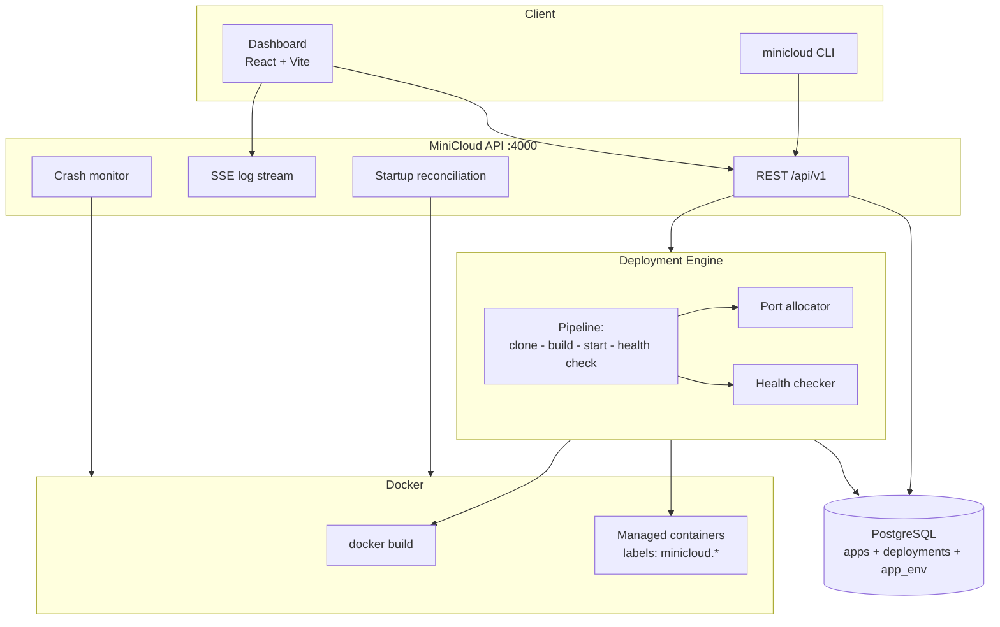
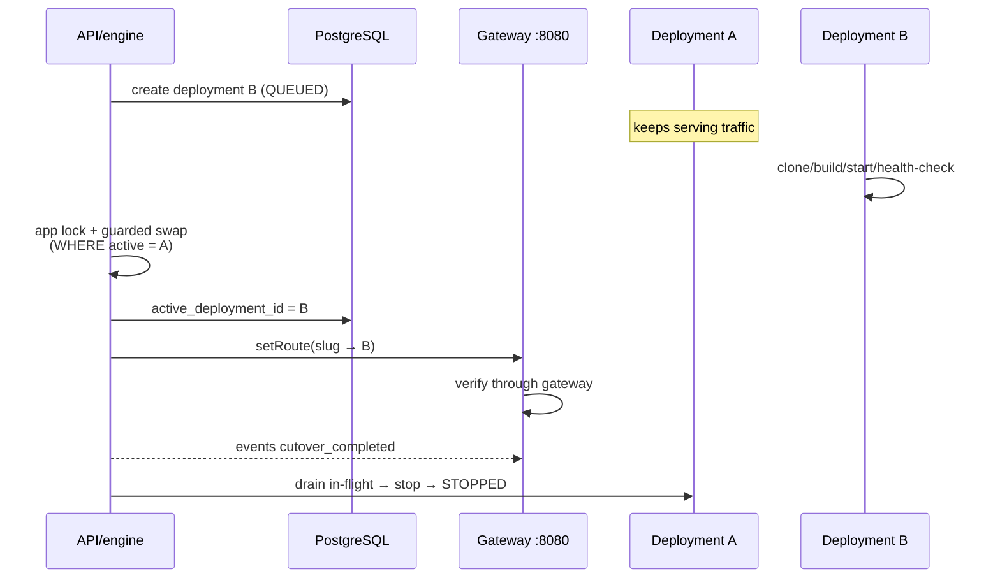
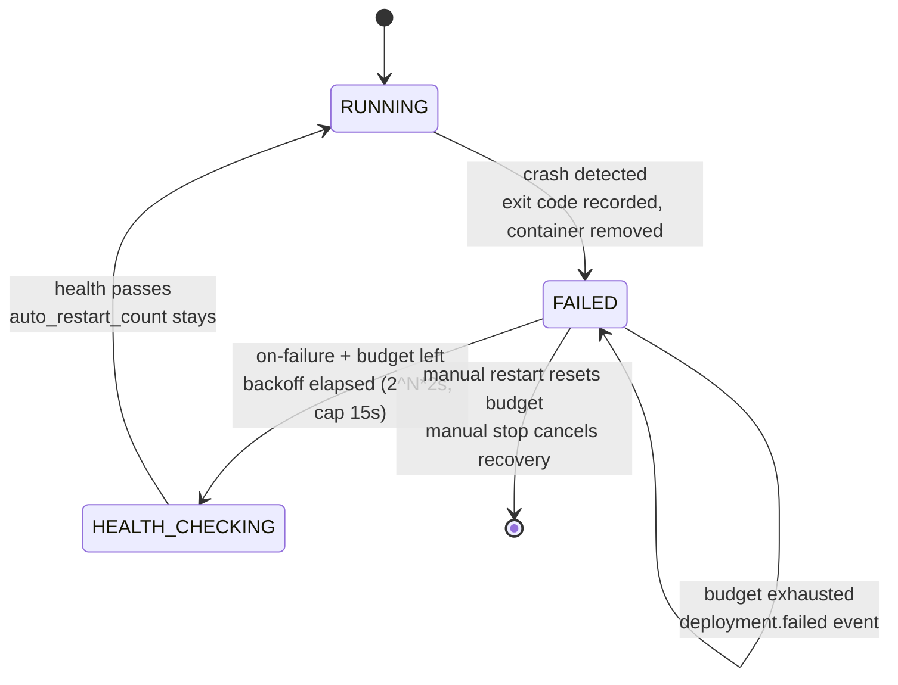
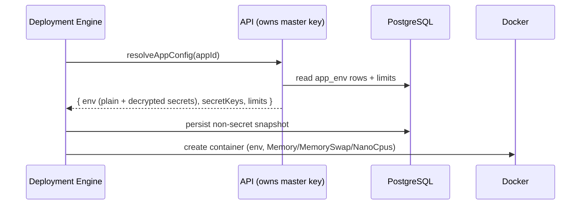

# MiniCloud Architecture

## Overview

MiniCloud is a single-host PaaS: a Fastify API owns a deployment engine that
turns git repositories into running Docker containers, with PostgreSQL as the
source of truth and a React dashboard for observation and control.



## Components

### apps/api (Fastify)
- Versioned REST API under `/api`.
- Server-Sent Events for live log fan-out (`GET /api/deployments/:id/logs` with `Accept: text/event-stream`).
- Startup reconciliation against Docker state.
- Central error handler; validation errors return per-field details.

### packages/deployment-engine
The core pipeline:

```text
QUEUED → CLONING → BUILDING → STARTING → HEALTH_CHECKING → RUNNING
   ↘ any stage failure → FAILED          user stop → STOPPED
```

1. **Clone** — `git clone` via `execFile` (argument array, never a shell string) into a temp dir inside the workspace. Shallow clone first, automatic fallback for servers that don't support it.
2. **Build** — requires a root-level `Dockerfile`. Image tag: `minicloud/app-<id8>:d-<depId12>`. Build output is streamed to log listeners.
3. **Port allocation** — random candidates from a configurable range, each probed with a bind test immediately before use. Docker's own bind is the final arbiter; collisions surface as clear start errors.
4. **Start** — container created with labels `minicloud.managed`, `minicloud.app`, `minicloud.deployment`. Never privileged, no host mounts, no restart policy (crash handling is explicit).
   Before creating the container the engine resolves the application's effective
   runtime configuration through a callback registered by the API layer (which
   owns the master key): plain env vars, decrypted secret values, and resource
   limits. Secret values exist only inside this call path — they are never
   logged and never persisted. The deployment's non-secret snapshot (plain
   values, secret *key names*, limits) is written to `deployments.config_snapshot`.
   Limits become cgroup controls on the container: `Memory` bytes with
   `MemorySwap = Memory` (hard cap, no swap) and `NanoCpus` (`--cpus`).
6. **RUNNING** — persisted with `started_at`.

Concurrency: one in-flight operation per deployment via an in-process lock map;
the SQL status guard (`UPDATE ... WHERE status = ANY(...)`) makes impossible
transitions unrepresentable even across processes.

### Crash detection
A monitor polls RUNNING deployments every few seconds. If the container exits or
disappears, the deployment becomes FAILED with the captured exit code and a
reason. There are no automatic restart loops in v0.1; `restart` is explicit.

### Startup reconciliation
On API boot:
1. List all containers labeled `minicloud.managed=true`.
2. Non-terminal DB rows whose container exited/missing → FAILED (+ exit code).
3. Healthy containers in pre-RUNNING states (API died mid-health-check) → RUNNING.
4. Terminal-state rows with leftover containers → containers removed.
5. Managed containers with no DB row (orphans) → removed.

The database is never blindly trusted: RUNNING requires a live container.

### Logs
Container stdout/stderr follows dockerode demuxing into SSE subscribers plus a
bounded recent-logs endpoint (`tail`). Build output flows through the same
fan-out with `source=build`. Nothing unbounded is held in memory (ring buffer of
last 500 lines client-side).

### Persistence

Four tables (`applications`, `deployments`, `app_env`, `deployment_events`) with
a CHECK-constrained status enum, migrated by `packages/db`'s runner. Ephemeral
runtime objects (containers, images) are always reconcilable from Docker;
durable history lives only in PostgreSQL.

### Gateway, stable URLs and zero-downtime cutover (v0.4)

An in-process reverse proxy (`packages/gateway`) listens on `GATEWAY_PORT`
(default 8080) and routes `http://<slug>.localhost:<port>` to the ACTIVE
deployment of that application. Routing decisions come exclusively from the
gateway's route table, which the engine fills from deployment state — request
input can never select an upstream (no SSRF surface).



Guards:

- Cutover runs under a per-application lock and a guarded SQL swap
  (`WHERE active_deployment_id IS NOT DISTINCT FROM <expected>`): a deployment
  that finished after being superseded retires itself instead of stealing
  traffic.
- Gateway verification happens through the gateway itself; failure reverts the
  swap and the route, and the previous version keeps serving.
- The active deployment's restart lands on a new port → the engine updates the
  route and verifies it (`gateway.route_updated`).
- Terminal crash / forced stop / forced delete of the active deployment clears
  the route (honest 503); automatic recovery re-points it on success.
- Startup reconciliation rebuilds the whole route table from
  `applications.active_deployment_id`, validates containers, clears stale
  pointers, and retires stale RUNNING deployments that are not active.

### Deployment events (v0.3)

Every lifecycle transition is persisted to `deployment_events` (migration 003):
`deployment.created`, `clone.*`, `build.*`, `container.*`, `health_check.*`,
`deployment.running`, `restart.*` (manual + automatic), `container.crashed`,
`rollback.*`, `stop.requested`, `deployment.stopped/failed/deleted`.

- Ordering is the monotonic `BIGINT identity id` — never timestamps, which can
  collide within a millisecond. The API returns them oldest-first.
- Events are written by the engine through a swallow-errors wrapper: a failed
  event insert logs a warning but never breaks a deployment.
- Metadata carries structural context only (attempt numbers, image tags, exit
  codes, ports) — never secret values.
- Rows cascade-delete with their deployment.

### Automatic restart & recovery (v0.3)

Applications configure a restart policy (`disabled` default, `on-failure`)
with an attempt budget of 0–10.



Design invariants:

- **Timer-free scheduling.** Due restarts live in `deployments.next_auto_restart_at`;
  the crash monitor tick (crash detection, then due-restart firing) is the only
  driver. No timers survive deleted deployments, and an API restart cannot lose
  a pending recovery.
- **Bounded.** `auto_restart_count` increments per automatic attempt; the budget
  is checked before scheduling and re-checked before firing. Exhaustion is
  terminal (`deployment.failed`).
- **Human actions reset the budget.** Manual restart sets `auto_restart_count=0`
  and clears any pending recovery; manual stop always cancels it.
- **Crash handling removes the dead container** (exit code is persisted first),
  so crashed containers do not accumulate.
- **Reconciliation reuses the same path**: a RUNNING row whose container died
  while MiniCloud was offline is treated exactly like a live crash.

### Rollback (v0.3)

`rollback(app, targetDeployment)` creates a NEW deployment referencing the
target via `rollback_of_deployment_id`:

1. Validation: same application, target has a built image, target is not
   in-flight.
2. **Image reuse (fast path)**: if the target's image still exists locally the
   pipeline walks QUEUED→CLONING→BUILDING (emitting a `build.skipped` event)
   and starts that image directly.
3. **Rebuild (fallback)**: otherwise the deployment's ref is set to the
   target's commit SHA and the pipeline clones and checks out that exact
   revision.
4. Configuration is the application's CURRENT config (consistent with restart
   semantics); the new deployment's snapshot records it. Historical rows and
   snapshots are never mutated.

### Retention & prune

`minicloud prune` (and startup reconciliation for containers) remove only
MiniCloud-owned resources: containers whose deployment is gone/terminal,
`minicloud/app-*` images no deployment references, and `clone-*` workspace
directories older than an hour. Images referenced by any deployment are kept —
they are rollback targets.

### Application configuration (v0.2)

Per-application config lives in two places:

- `app_env` table: one row per key per app. Plain variables store their value;
  secrets store only AES-256-GCM ciphertext under an scrypt-stretched
  operator master key. A CHECK constraint makes the two value shapes mutually
  exclusive.
- `applications.memory_limit_mb` / `cpu_limit`: current limits.

Resolution flow at container start:



Failures in this stage fail the deployment cleanly (`config` stage reason), for
example when secrets exist but `MINICLOUD_MASTER_KEY` is not configured.
Restart re-runs resolution so containers pick up changed configuration without
a rebuild; the snapshot is refreshed to stay truthful about the running
container. Historical deployments keep their original snapshot.
