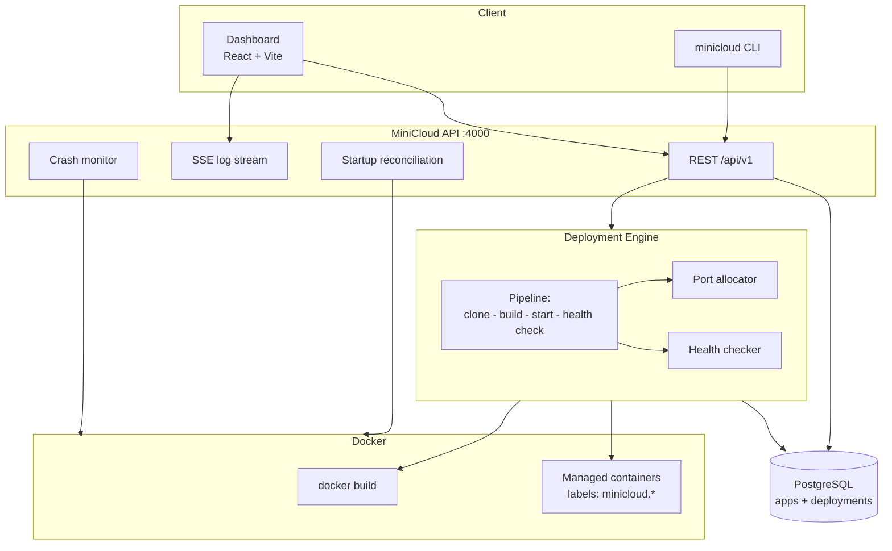

# MiniCloud Architecture

## Overview

MiniCloud is a single-host PaaS: a Fastify API owns a deployment engine that
turns git repositories into running Docker containers, with PostgreSQL as the
source of truth and a React dashboard for observation and control.



## Components

### apps/api (Fastify)
- Versioned REST API under `/api`.
- Server-Sent Events for live log fan-out (`GET /api/deployments/:id/logs` with `Accept: text/event-stream`).
- Startup reconciliation against Docker state.
- Central error handler; validation errors return per-field details.

### packages/deployment-engine
The core pipeline:

```text
QUEUED → CLONING → BUILDING → STARTING → HEALTH_CHECKING → RUNNING
   ↘ any stage failure → FAILED          user stop → STOPPED
```

1. **Clone** — `git clone` via `execFile` (argument array, never a shell string) into a temp dir inside the workspace. Shallow clone first, automatic fallback for servers that don't support it.
2. **Build** — requires a root-level `Dockerfile`. Image tag: `minicloud/app-<id8>:d-<depId12>`. Build output is streamed to log listeners.
3. **Port allocation** — random candidates from a configurable range, each probed with a bind test immediately before use. Docker's own bind is the final arbiter; collisions surface as clear start errors.
4. **Start** — container created with labels `minicloud.managed`, `minicloud.app`, `minicloud.deployment`. Never privileged, no host mounts, no restart policy (crash handling is explicit).
5. **Health check** — HTTP GET on `<host>:<port><healthPath>` until success or timeout.
6. **RUNNING** — persisted with `started_at`.

Concurrency: one in-flight operation per deployment via an in-process lock map;
the SQL status guard (`UPDATE ... WHERE status = ANY(...)`) makes impossible
transitions unrepresentable even across processes.

### Crash detection
A monitor polls RUNNING deployments every few seconds. If the container exits or
disappears, the deployment becomes FAILED with the captured exit code and a
reason. There are no automatic restart loops in v0.1; `restart` is explicit.

### Startup reconciliation
On API boot:
1. List all containers labeled `minicloud.managed=true`.
2. Non-terminal DB rows whose container exited/missing → FAILED (+ exit code).
3. Healthy containers in pre-RUNNING states (API died mid-health-check) → RUNNING.
4. Terminal-state rows with leftover containers → containers removed.
5. Managed containers with no DB row (orphans) → removed.

The database is never blindly trusted: RUNNING requires a live container.

### Logs
Container stdout/stderr follows dockerode demuxing into SSE subscribers plus a
bounded recent-logs endpoint (`tail`). Build output flows through the same
fan-out with `source=build`. Nothing unbounded is held in memory (ring buffer of
last 500 lines client-side).

### Persistence
Two tables (`applications`, `deployments`) with a CHECK-constrained status enum,
migrated by `packages/db`'s runner. Ephemeral runtime objects (containers,
images) are always reconcilable from Docker; durable history lives only in
PostgreSQL.
